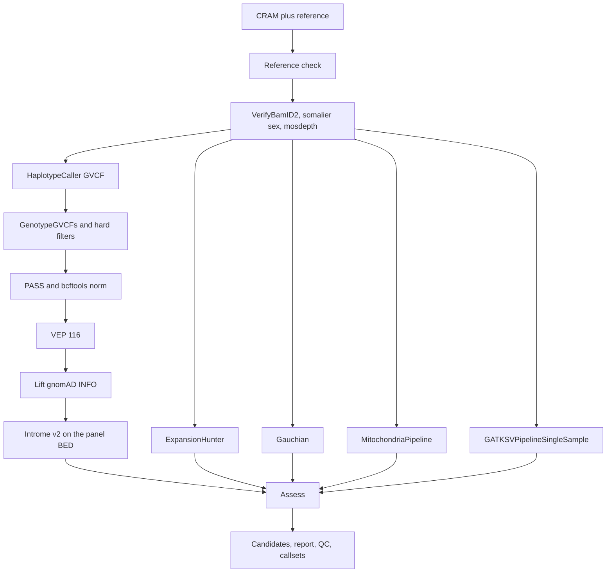

# Per-sample Parkinson's variant assessment

One Terra sample row goes in as a CRAM. `PdSample` calls every required tool from that CRAM, annotates the small-variant VCF, and writes a ranked candidate list for that person. A cohort is a Terra `sample_set`: Terra launches `PdSample` once per row. There is no cohort workflow.



## Dockstore

Register the repository root. `.dockstore.yml` publishes one workflow:

| Name | Descriptor | Example JSON |
| --- | --- | --- |
| `PdSample` | `/workflow/wdl/PdSample.wdl` | `/workflow/terra/PdSample.example.json` |

Import `PdSample` into a Terra workspace. Bind `sample_id`, `cram`, `crai`, and `sex` to the sample table. Put reference and resource files on the workspace data table or in the method configuration.

## Terra sample table

| Column | Required | Meaning |
| --- | --- | --- |
| `sample_id` | yes | Identifier written into outputs. Use a synthetic id in examples. |
| `cram` | yes | Aligned GRCh38 CRAM for this row. |
| `crai` | yes | CRAM index. |
| `sex` | no | `male` or `female`. Blank, `unspecified`, or anything else is inferred from somalier, then from the X heterozygosity rate. |

A `sample_set` is only a list of those rows. Terra runs `PdSample` per row. Shared reference inputs stay in the method config.

`workflow/terra/PdSample.example.json` uses `SYNTHETIC_SAMPLE`, `gs://YOUR_WORKSPACE_BUCKET/...` placeholders for the CRAM and for the VEP cache and somalier sites (see [`workflow/terra/STAGING.md`](workflow/terra/STAGING.md)), raw GitHub URLs on `main` for files in this repo, the public VerifyBamID 2.0.3 resource files, the public GATK hg38 chrM bundle, and the public GATK-SV v0.29-beta hg38 resources plus the 1KG reference panel. `pdvar_git_commit` defaults to `main` on https://github.com/gqworks/pdsample-terra. After this snapshot is published, pin that input to the commit SHA of `pdsample-terra` so Terra does not float. `workflow/terra/PdSample.terra_inputs.json` is the Terra form of that config: sample fields are `this.sample_id`, `this.cram`, `this.crai`, and `this.sex`, the mitochondria files are the same public `gs://` paths, `vep_cache` and `somalier_sites` stay `gs://YOUR_WORKSPACE_BUCKET/...`, and each GATK-SV file is a `workspace.<key>` expression. The mapping is `workflow/terra/gatksv_panel_keys.md`.

## What each stage does

1. **Reference check.** The CRAM `@SQ` MD5s are compared with the reference dictionary. A missing `chr` prefix fails the check.
2. **QC.** VerifyBamID2 contamination (`FREEMIX` above 0.02 fails the sample by default), somalier extract plus relate on this sample only (sex; relatedness is not run), and mosdepth on the calling BED. Callers wait on the QC gate.
3. **Small variants.** GATK 4.6.1.0 HaplotypeCaller in GVCF mode, then GenotypeGVCFs, then GATK hard filters, then `bcftools view -f PASS` and `bcftools norm -m -both`. Intervals default to `workflow/assets/monopdaus-genes.grch38.bed`. Set `wgs_small_variants` true to call the whole genome.
4. **Structural variants.** `GATKSVPipelineSingleSample` v0.29-beta runs on every sample. The reference-panel and hg38 resource inputs are required. `sv_status` is `called`. A missing SV VCF is an error in `pdvar assess`.
5. **STRs.** ExpansionHunter 5.0.0 with the vendored 19-locus catalog `workflow/assets/expansionhunter_pd.hg38.json`.
6. **GBA1.** Gauchian 1.0.2.
7. **mtDNA.** GATK `MitochondriaPipeline` 4.7.0.0.
8. **VEP 116.2.** Offline cache, GRCh38, `--pick`. Optional `--custom` gnomAD (`AF|AF_popmax|nhomalt`) and ClinVar. A following task copies `INFO/gnomAD` into `INFO/gnomAD_AF` and `INFO/AF_popmax` so the Introme rare filter can see them.
9. **Introme v2.** Native WDL port of CCICB/introme `d6da48bc84abda66f588470f79abcf1244acfb21` (`v2@d6da48b`). Restricted to the panel BED. SpliceAI, MMSplice, Pangolin, SPiP, and Spliceogen run in parallel after VariantInfo.
10. **Assess.** `pdvar assess` ranks candidates and writes the Terra outputs.

## Hard filters

Single-sample hard filters are used because VQSR fits tranches on a cohort and this repository does not ship a CNN scoring model. SNP sites fail when `QD < 2.0`, `QUAL < 30.0`, `SOR > 3.0`, `FS > 60.0`, `MQ < 40.0`, `MQRankSum < -12.5`, or `ReadPosRankSum < -8.0`. INDEL sites fail when `QD < 2.0`, `QUAL < 30.0`, `FS > 200.0`, or `ReadPosRankSum < -20.0`. Only `PASS` records continue.

## Outputs written back to the row

| Output | File |
| --- | --- |
| `candidates_tsv` | Ranked variants that are not `not_qualifying` |
| `report_md` / `report_html` | Per-sample triage report |
| `qc_summary` | QC JSON, including module status and `sv_status` |
| `liability_tsv` / `followup_tsv` | Explained-liability row and single-hit follow-up |
| `gvcf`, `small_vcf` | HaplotypeCaller GVCF and filtered small-variant VCF |
| `vep_vcf` | VEP VCF after the gnomAD INFO lift |
| `sv_vcf` / `sv_vcf_index` | GATK-SV single-sample VCF and index |
| `sv_status` | `called` |
| `expansionhunter_vcf`, `gauchian_json`, `mtdna_vcf` | STR, GBA1, and mtDNA callsets |
| `introme_tsv`, `introme_vcf` | Introme scores |
| `sex_used` | Provided sex, or the inferred value |
| `sample_json` | Internal JSON the Assess task reads |

## Assess container

Build from the repository root and push:

```bash
docker build -f workflow/containers/pdvar/Dockerfile -t REGISTRY/pdvar:COMMIT .
docker push REGISTRY/pdvar:COMMIT
```

Set `pdvar_docker` to that image. The image copies this package, `config/`, and `resources/panel/`.

To run without a custom image, leave `pdvar_docker` at `python:3.11.11-slim-bookworm`. `pdvar_git_commit` defaults to `main`, and the task installs `git+https://github.com/gqworks/pdsample-terra.git@main`. Pin `pdvar_git_commit` to a commit SHA of `gqworks/pdsample-terra` for a reproducible run. An empty commit with no installed `pdvar` stops the task.

## Two panel BEDs

`workflow/assets/monopdaus-genes.grch38.bed` is the calling and Introme interval list (gene spans). `resources/panel/monopdaus-genes.grch38.bed` and `monopdaus-exons.grch38.bed` are the overlap BEDs the SV scorer uses. Inheritance labels live in `resources/panel/monopdaus-gene-inheritance.csv` and are placeholders pending expert review. `GBA` is aliased to `GBA1`.

## Cost

The default interval list keeps HaplotypeCaller, VEP, and Introme on the panel gene spans. Whole-genome small-variant calling (`wgs_small_variants`) and a full GATK-SV reference-panel run dominate cost. Introme's SpliceAI, MMSplice, and Pangolin tasks are the next largest CPU (or GPU) block. ExpansionHunter, Gauchian, VerifyBamID2, somalier, and mosdepth are small beside those. The mitochondria workflow realigns chrM. There is no joint genotyping and no VQSR.

`ReleaseAfterQc` hardlinks the CRAM after the QC gate so the imported mitochondria and GATK-SV workflows do not start early. The task disk is twice the CRAM size so a cross-filesystem copy can finish when a hardlink is unavailable.

## Local assessment

```bash
pip install -e ".[dev]"
pdvar assess sample.json --panel resources/panel/monopdaus-gene-inheritance.csv --outdir out
pytest
bash workflow/scripts/validate_wdl.sh
```

`pdvar expression-urls` prints GTEx and gnomAD pext locations and downloads nothing. `scripts/fetch_expression_resources.py` builds an optional expression table.

## Scientific scope

The scorer keeps panel genes, ACMG-style point evidence (ClinVar P/LP, predicted null alleles, CADD, REVEL, SpliceAI, absent gnomAD, Introme), a second allele inside the same sample, SV/STR/GBA1/mtDNA rows, isoform and expression weights, and penetrance scaffolding. Point totals are a triage rank. They are not an ACMG/AMP classification. Penetrance, PRS coefficients, expression cutoffs, and STR pathogenic repeat counts stay null until a citation is set in `config/config.yaml`. TTN truncations are tagged `incidental` and are not relabelled benign. Compound hets stay `AR_comphet_candidate` unless the VCF already carries a shared `PS` tag.

Resources you still have to stage are listed in [`workflow/terra/STAGING.md`](workflow/terra/STAGING.md) and [`docs/setup_checklist.md`](docs/setup_checklist.md). Tool versions and images are in [`workflow/README.md`](workflow/README.md).
